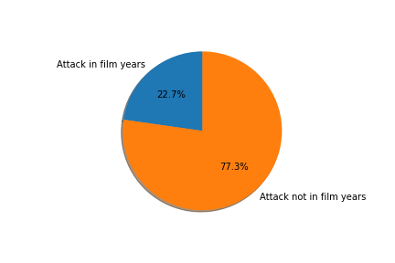

# Shark-Attack

Thanks to the data obtained from the dataset "attacks", we obtained valous information of the sharks and victims behaviour over the last years. After understanding and cleaning this dataset, those are my hypothesis related to this subject: 

HYPOTHESIS 1: THE INVESTIGATOR WITH MORE CASES IS INDEED THE ONE WITH MORE PRESTIGE

Let's get started! This hypothesis hold a lot of different aspects that must be taken into account, and I try to summarize them into 4 different categories: The total cases, the internationality, the importance of the case and the actuality of the case. So basically, to determine the prestige of an investigator, we must consider its position in all this different categories.

As you can see in this plot, just looking at the total cases there are a few investigators that are really distinguishing from the rest:
Creswell, Moore, Collier and Petersohn are our top horses in terms of investigation. But as told before, there are more things who is the most respectful, as Collier is just 1 case up of Moore and the rest are in close third and fourth poisition. 

In the next graph I will just take into consideration the dated cases after the year I was born, as the opinion of an investigator may change if the case is "recent" and people remember it. To make it easier I just show the 4 investigators with more cases in this last period. 

According to this study... Where is C. Moore? Either he is just a really veteran investigator or he just forgot to date his cases. The rest of them, as suspected, are in first positions, as well as T.Peake make his first All-Star appearance as a top 4. 

For the next categoriy, we will define the prestige in terms of internationality; who has traveled more to investigate a shark attack?

Contradicting myself... Where is not C. Moore? After losing some positions in the last round, this man has come back strong. The rest of the powerful candidates just want to stay in the same places. The most amazing person is Mr. Johansson, that according to the first graph has not take a lot of cases, but for sure he likes to travel. 
And we are going to the final part of this race to prestige! On the last pie I just try to summarize which cases had more relevance, and because it is difficult to quantify, I just take one thing present: if the case involves fatal victims or not. Here I present the top 5 investigators whose case involve a fatal victim by sharks:

Out of the 5 investigators with more death victims studied, C. Moore is present in more than half of this cases! Now is moore clear than ever (sorry for the bad joke) that this investigator is our most prestigious guy! 

So to conclude, I have to refuse my hypothesis: although Collier is the investigator with more cases, in this data the most relevant investigator is no other than Mr. Moore. 
 

HYPOTHESIS 2: SHARKS ARE NOT DEAF AND KNOW THE NAME OF SEALS

For over the centuries, sharks has freightened the human kind. While other animals such as the little mosquitoes or the big Hippos are way more dangerous, there is something about the deep of the ocean and the big monstruous teeth that make us fear them instantly. But actually, we are not its prey; they are just confusing us with seals. 

In that hypothesis, after finding that the shark ear is way more developed that the human ear, I just realized... MAYBE they are just confusing the sound we are making. It is normal for us to name our pets, such as cats or dogs. But what if seals, the favourite prey of sharks, have names? And furthermore, what if sharks know it and relate certain names, or sounds, with a seal? Okay that might not be the most realistic hypothesis so far, but it is worth a try!

First of all, let's start with the basics; In the DataFrame there were multitude of cases without names, or named just by "male", "female", "child", etc, so we just take into account the data with the actual name of the victims, and for this study I just picked the first letter of the name; It is not the best scenario, but it define a good pattern as all names start with a letter (Duh) and we do not know the time of the actual attack; if it is less than 0.1 seconds when someone is saying your name, they for sure are just able to listen to the first letter. If the victim was alone, maybe he/she was talking with themselves. I do not judge. The only risky assumption here is that the shark ALWAYS listened to the first letter of your name, and recognize the sound. Again, is not the most accurate theory in the world. 

As shown in the graph, there are some first letter names that could easily fit a seal, the most common bein "J", "M" and "A". Careful Archie, you could have possibly be named after a seal!

To confirm this Hypothesis we must know the actual name of seals, so the results of this test are inconclusive. But just in case it is true, if your name is Jason and you are near a shark, just avoid presenting yourself.

To get deeper into this theory, I just made a new chart reflecting the number of death victims also filtered by the first letter of their name out of the total cases. 

This made me doubtful; there were differences between death percentage between some names with certain first letters. The question was obvious: Does people with certain first letters are not really human? Are seals among us? Could you have one sitting right next to you? Freightening. 

According to the data set, people whose names start with "U", "Y", "Q", "W" or "F" are the most common of, after bein attacked by a shark, be eaten alive. Watching previous charts, we can see that the majority of this letters are not really common in the victims, except the "W". Maybe we just have found our impostors! Or, just a more boring theory, the people whose name start with "W" have a similar diet to the seals, basing their alimentation in tons of fishes. I hope it is the first one (I remember my friend Wilson could swim really well). 

HYPOTHESIS 3: SHARKS ARE NOT REALLY INTO CINEMA

After days of intense research I have not come to a conclusion: Any data about sharks show if they like Pop Corn, and it is basically why we humans go to see the movies. 
Speaking about the films themselves, since the film Jaws by Steven Spielberg was released back in 1975, the cinematic universe surrounding sharks has been outstanding. Good (not so many) and bad (way too many) films about sharks has been in our lifes from that day. For this hypothesis, I wanted to know if we can see a pattern between the top 10 most popular Shark movies since Jaws and the number of attacks in those years. Are they related?

The first approach is clear: The movie that most inspire the sharks to attack people is without a doubt "47 meters down". On this year there were more attacks than even the years were 2 films were released (Trying to read a shark's mind, I can understand that both Sharknado and Soul Surfer are not clearly the best insipiration, as normally there are not such things as shark tornadoes and in Soul Surfer the shark actor was done by the beginning).

But here is when the key point of this hypothesis must be proven! Since 1975, Is there a difference between the shark attacks in the years were any of their most popular films were released, or not?

In this pie there is the total number of attacks in the years of this films compared to the rest of the years since 1975

Although this could confirm my theory, I confess I was a bit biased and I should rephrase my pie: The sum of years since 1975 without a top 10 film was in cinemas is way bigger than the 8 years where there was at least 1 of this movies. 

In the new pie there is the total number of attacks PER YEAR spliting them in the talked two groups: 

Reluctantly, I must admit that I was wrong: the sharks are really into cinema, as in the years when a top shark film was released, the number of attacks is greater than the rest of the years since Spielberg's masterpiece. 

I hope you liked my analyisis about this fascinating subject. See you next week!